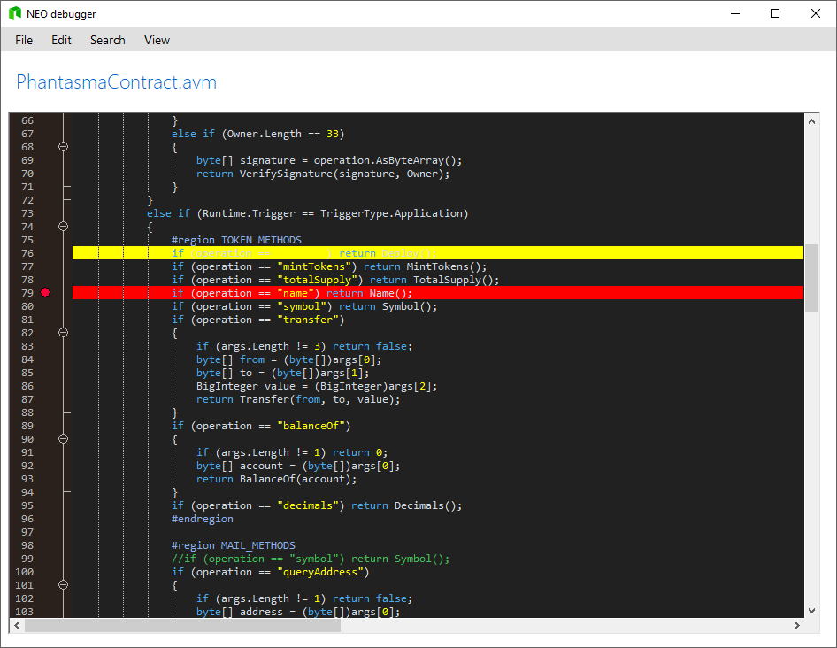
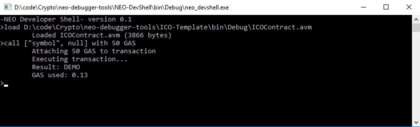

<p align="center">
  
</p>

<h1 align="center">neo-debugger-tools</h1>

<p align="center">
  NEO debugger tools for <b>NEO</b> smart contracts.
</p>

- [Overview](#overview)
- [Usage](#usage)
- [Support for Other Languages](#support-for-other-languages)
- [Roadmap](#roadmap)
- [Credits and License](#credits-and-license)

---

## Overview
A suite of development tools for NEO smart contracts.  
Includes a cli disassembler and a GUI debugger. A helper library that helps loading `.avm` files and create and load `.neomap` files is also included, and can be used to create other dev tools.

(click picture to view video)

[](https://youtu.be/KnPHIaEsgtA "Introduction video")

### How this works

1. A modified NEO compiler to compile C#/Python/etc into an `.avm` file and, at same time, emit a `.debug.json` file.
2. A debugger IDE will load the `.avm` and disassemble it into readable opcodes.
3. The debugger IDE can also run or step through either the assembly code or the original source (if the `.debug.json` file is present in same directory as the `.avm`)
4. The debugger will also emulate the smart contracts' API that interacts with the Blockchain (like Storage, Transactions, Blocks)

### Setup 
1. Get this code and open the solution in Visual Studio.
2. Compile the solution and find the compiled NEON.exe path (should be in $(SolutionPath)\NEO-Compiler\bin\Debug).
3. Replace the path of your old NEON compiler to the new compiler path. 
4. When you compile a smart contract, it will accordingly use the debugger compiler and produce (next to the`.avm`) the map file which you need to step through the code.

### Current Features

- Supports any NEO `.avm`, regardless of the language / compiler used
- Source viewer with syntax highlight powered by ScintillaNET
- Run, step and set breakpoints in order to debug smart contracts
- Toggle between source code and assembly code

### Limitations

- Debugging ASM, C# and Python only for now (see section below how to add new languages)
- Windows only for now, using .NET Framework / Winforms / ScintillaNET
- Smart contract source is limited to a single file for now
- Not possible yet to inspect variable values
- Some NEO syscalls / APIs not supported yet (work in progress)


## Usage

Open the `.avm` file in the NEO-dbg GUI application.
This will show either assembly code for the `.avm` or C# if a debug map file was found.
Currently the only way to generate a `.neomap` file is to compile the smart contracts with the modified NeoN compiler included in this repository.

### Shortcuts

| Key           | Action                                    | Comments                                      |
| ------------- |:------------------------------------------| :---------------------------------------------|
| F5            | Executes the smart contract               |                                               |
| F10           | Steps through the smart contract          |                                               |
| F12           | Toggles between assembly and source code  | Only works when a `.neomap` file is available |

## Smart Contract Inputs

### ABI files

A single smart contract can have different results and behaviours, depending on the inputs passed to it.

So, when debugging a contract, it is necessary to be able to know what methods are supported and specify the inputs for them. 

Currently this is done via a `.abi.json` file that resides in the same folder as the debugger executable (should generated automatically by the compiler, but can also be hand-written if necessary).

This file should have the same name as the `.avm` file. So if your contract file is `hello.avm`, make sure the input file is called `hello.abi.json`.

Here's a example contract that takes a string and array of objects as argument.

```c#
using Neo.SmartContract.Framework;
using Neo.SmartContract.Framework.Services.Neo;
using System;
using System.Numerics;

namespace Example {
    public class Calculator : SmartContract {
        public static int Main(string operation, params object[] args) {
            int arg0 = (int)args[0];
            int arg1 = (int)args[1];

            if (operation == "add") { return arg0 + arg1; }
            if (operation == "sub") { return arg0 - arg1; }

            return -1;
        }
    }
}
```

And here's how the `.abi.json` would look for this contract.

```json
{
    "hash":"0x8661a692f3fbd62973d64cf31ef0e9718425aad2",
    "entrypoint":"Main",
    "functions":
    [
        {
            "name":"Main",
            "parameters":
            [
                {
                    "name":"operation",
                    "type":"String"
                },
                {
                    "name":"args",
                    "type":"Array"
                }
            ],
            "returntype":"Any"
        },
    ],
    "events":
    [
    ]
}
```

In order to insert strings as inputs put quotes around them (eg: "hello").

For arrays separate each element with commas and put everything into brackets (eg: [2, 3, 5]). For byte arrays, you can also just insert a single hexadecimal string (eg: FF03DA22)

### Test cases

When debugging a contract, it is also convenient to be able to specify a pre-defined set of test inputs. Currently this is supported via a `.test.json` file that resides in the same folder as the debugger executable.

This file should have the same name as the `.avm` file. So if your contract file is `hello.avm`, make sure the input file is called `hello.test.json`.

Here's a example of how to specify test cases.

```javascript
{
	"cases": [
		{
			"name": "add(5,3)",
			"method": "Main",
			"params": ["add", [5, 3]]
		},
		{
			"name": "sub(7,2)",
			"method": "Main",
			"params": ["sub", [7, 2]]
		},
	]				
}
```

### Storage Emulation

The debugger supports emulation of the Storage API, meaning Storage.Put and Storage.Get work fine when debugging. 

The actual data is stored in a file with extension `.store`, in same folder as the `.avm`. If required to reset the smart contract storage, it's fine to delete this file.

In the latest version it is possible to view the storage contents using the Debug>Storage menu.


### Asset Transfer

The current version does support sending virtual NEO and GAS to the smart contract, emulating an asset transfer.

## Supported Programming Languages

NEO smart contracts can be coded in many different languages, and in theory, this compiler already supports any language as long as a `.neomap` file exists in the same directory as the `.avm` file.
However, in order to be able to debug an compiled `.avm` file, the compiler used must be able to emit those map files during compilation. 
The table below lists the current supported languages / compilers.

| Language      | Compiler                          		| Comments                                      								|
| ------------- |:------------------------------------------| :-----------------------------------------------------------------------------|
| C#        	| neon               						| Only supported if using the neon version from this repository.				|
| Python        | [neo-boa](https://github.com/CityOfZion/neo-boa)| 					                            						|


To add other languages it would be necessary to modify compilers to emit a `.neomap`.
The `.neomap` file format is `json` and consists of a `compiler` section that includes info about the compiler used, `files` section including list of source code files used to generate the `avm`, an `avm` section including an MD5 hash of the compiled `avm`, plus an `map` section used to map start and end byte offsets to source code.

```json
{
    "compiler": {
        "name": "neo-boa",
        "version": "0.1"
    },
    "files": [
        {
            "url": "D:\\MySmartContracts\\HelloWorld.py",
            "id": "1"
        }
    ],
    "avm": {
        "name": "AddTest",
        "hash": "c485df80dc0551162a344ed1617956e5"
    },
    "map": [
        {
            "start": 17,
            "end": 43,
            "file": 1,
            "line": 10
        },
        {
            "start": 44,
            "end": 61,
            "file": 1,
            "line": 11
        },
        {
            "start": 62,
            "end": 88,
            "file": 1,
            "line": 13
        },
        {
            "start": 89,
            "end": 100,
            "file": 1,
            "line": 14
        }
    ]
}
```

### Developer Shell

A developer shell is also included and can be used to emulate and debug NEO smart contracts from the terminal. 

The smart contract inputs should also be passed as a JSON string, same as in the debugger GUI.

If using Linux or OSX, [Mono](http://www.mono-project.com/) is required.



## Unit testing

The NEO emulator library makes it easy to create your own unit tests for smart contracts. 

### Install

It's not necessary to download the debugger and the others tools if you just need Unit Testing.

In that case, just install the Neo.Emulator, which is available as a Nuget package.

    PM> Install-Package Neo.Emulator

### Example
```c#
using System.IO;
using LunarParser;
using Neo.Emulator;
using NUnit.Framework;

[TestFixture]
public class ContractTests
{
	private static NeoEmulator emulator; 

	// load the .avm file before tests run
	[OneTimeSetUp]
	public void Setup()
	{
		var path = TestContext.CurrentContext.TestDirectory.Replace("ICO-Unit-Tests", "ICO-Template");
		Directory.SetCurrentDirectory(path);
		var avmBytes = File.ReadAllBytes("ICOContract.avm");
		emulator = new NeoEmulator(avmBytes);
	}

	[Test]
	public void TestSymbol()
	{
		// create the inputs to be passed to the NEO smart contract
		var inputs = DataNode.CreateArray();
		inputs.AddValue("symbol");
		inputs.AddValue(null);

		// reset the Emulator then run it
		emulator.Reset();
		emulator.Run(inputs);

		// obtain the smart contract output
		var result = emulator.GetOutput();
		Assert.NotNull(result);

		// validate output
		var symbol = result.GetString();
		Assert.IsTrue(symbol.Equals("DEMO"));
	}
}   
```


## Demo Project

In the folder ICO Template you can find an example of a complex `.json` input file. 

Included is also a small project to demonstrate unit tests of the demo project.

## Roadmap
- Transactions emulation (In progress)
- Debugger map generation for Java / Python / others


## Credits and License

Created by Sérgio Flores (<http://lunarlabs.pt/>).

Credits also go to the NEO team(<http://neo.org>), as a large part of this work was based on their [NEO compiler](https://github.com/neo-project/neo-compiler) and [NEO VM](https://github.com/neo-project/neo-vm).

This project is released under the MIT license, see `LICENSE.md` for more details.
