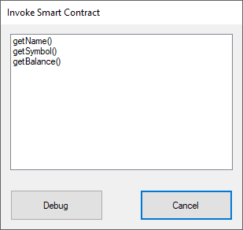

<p align="center">
  
</p>

<h1 align="center">neo-debugger-tools</h1>

<p align="center">
  NEO debugger tools for <b>NEO</b> smart contracts.
</p>

- [Overview](#overview)
- [Usage](#usage)
- [Support for Other Languages](#support-for-other-languages)
- [Roadmap](#roadmap)
- [Credits and License](#credits-and-license)

---

## Overview
A suite of development tools for NEO smart contracts.  
Includes a cli disassembler and a GUI debugger. A helper library that helps loading `.avm` files and create and load `.neomap` files is also included, and can be used to create other dev tools.


### How this works

1. A modified NEO compiler to compile C# into an `.avm` file and, at same time, emit a `.neomap` file.
2. A debugger IDE will load the `.avm` and disassemble it into readable opcodes.
3. The debugger IDE can also run or step through either the assembly code or the original source (if the `.neomap` file is present in same directory as the `.avm`)
4. The debugger will also emulate the smart contracts' API that interacts with the Blockchain (like Storage, Transactions, Blocks)

### Current Features

- Supports any NEO `.avm`, regardless of the language / compiler used
- Source viewer with syntax highlight powered by ScintillaNET
- Run, step and set breakpoints in order to debug smart contracts
- Toggle between source code and assembly code

### Limitations

- Debugging ASM and C# only for now (see section below how to add new languages)
- Windows only for now, using .NET Framework / Winforms / ScintillaNET
- Smart contract source is limited to a single file for now
- Not possible yet to inspect variable values
- Most NEO syscalls / APIs not supported yet (work in progress)


## Usage

Open the `.avm` file in the NEO-dbg GUI application.
This will show either assembly code for the `.avm` or C# if a debug map file was found.
Currently the only way to generate a `.neomap` file is to compile the smart contracts with the modified NeoN compiler included in this repository.

### Shortcuts

| Key           | Action                                    | Comments                                      |
| ------------- |:------------------------------------------| :---------------------------------------------|
| F5            | Executes the smart contract               |                                               |
| F10           | Steps through the smart contract          |                                               |
| F12           | Toggles between assembly and source code  | Only works when a `.neomap` file is available |

### Smart Contract Inputs

A single smart contract can have different results and behaviours, depending on the inputs passed to it.

So, when debugging a contract, it is necessary to be able to specify the inputs. Currently this is done via a `.json` file that resides in the same folder as the debugger executable.

This file should have the same name as the `.avm` file. 

Here's a example contract that takes a string and array of objects as argument.

```c#
using Neo.SmartContract.Framework;
using Neo.SmartContract.Framework.Services.Neo;
using System;
using System.Numerics;

namespace Example {
    public class Calculator : SmartContract {
        public static int Main(string operation, params object[] args) {
            int arg0 = (int)args[0];
            int arg1 = (int)args[1];

            if (operation == "add") { return arg0 + arg1; }
            if (operation == "sub") { return arg0 - arg1; }

            return -1;
        }
    }
}
```

And here is how to define inputs for it via the `.json` file.

```javascript
{
	"contract": {
		"params": "0710",
		"inputs": [
			{
				"name": "add(5,3)",
				"params": ["add", [5, 3]]
			},
			{
				"name": "sub(7,2)",
				"params": ["sub", [7, 2]]
			},
		]				
	}
}
```

The different inputs in this file will appear in the debugger when you execute the contract.

Note that the "name" field here can be anything, it is just used to display in the debugger GUI. Optionally you can modify the inputs in the text box.



### Storage Emulation

The debugger supports emulation of the Storage API, meaning Storage.Put and Storage.Get work fine when debugging. 

The actual data is stored in a file with extension `.store`, in same folder as the `.avm`. If required to reset the smart contract storage, it's fine to delete this file.

## Support for Other Languages

NEO smart contracts can be coded in many different languages, and in theory, this compiler already supports any language as long as a `.neomap` file exists in the same directory as the `.avm` file.
However, since only NeoN was modified to emit those map files during compilation, to add other languages it would be necessary to modify other compilers to emit a `.neomap`.
The `.neomap` file format is simple; for each line you need to list a starting offset, ending offset, the source line and the corresponding source file, all values separated by a comma.


## Roadmap
- Transactions emulation
- Debugger map generation for Java / Python / others


## Credits and License

Created by Sérgio Flores (<http://lunarlabs.pt/>).

Credits also go to the NEO team(<http://neo.org>), as a large part of this work was based on their [NEO compiler](https://github.com/neo-project/neo-compiler) and [NEO VM](https://github.com/neo-project/neo-vm).

This project is released under the MIT license, see `LICENSE.md` for more details.